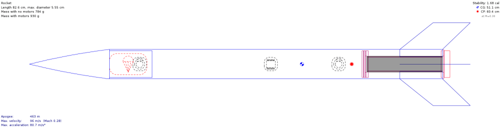
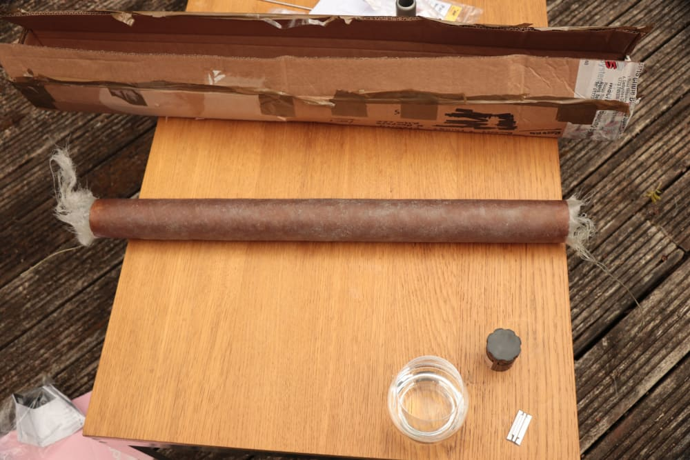

+++
date = '2022-03-09T00:00:00+00:00'
draft = false
title = 'Budget Fibreglassing: The Journey So Far'
image = 'team.png'
tags = [
    "manufacturing"
]
+++
Fibreglass is a composite material favoured for its high strength-to-weight ratio and adaptable assembly process. The two primary materials are sheets of woven glass strands (hereafter “fabric”) and resin, combining the tear-resistance and basic shape of the fabric with the hardness and stiffness of the resin. Fibreglass tends to be quite easy to create dynamic, custom shapes with because one need only shape the fabric as desired (often around a mould or a mandrel) then set it in place with a resin mix to create a hard object that holds the geometry first applied to the fabric.

All these properties make fibreglass an attractive material for broad swathes of applications, from marine hulls, tools, and civil engineering to our favourite activity - aerospace. We use it because its strength allows us to construct rockets that are resistant to failure in their launch and recovery, and therefore reusable. Over the last few months, we’ve worked with fibreglass in increasing amounts to develop our model rockets and have been very satisfied with the results!
## A Timeline
### Small Mike

Small Mike is the name of our much-beloved first home-designed rocket. This adorable little fellow is a simple design with a fibreglass body, 3d-printed Von Karman nosecone and through-the-body acrylic fins.

This design was our very first encounter with fibreglass, so we were starting effectively blind. We’ve found much of the information about using the material is often confusing and contradictory on the internet, and most of our best knowledge came from youtube videos which provided visual proof and results, and our own estimations. While the rocket flew and the fibreglass did its job excellently (keep reading), we learned a lot from the experience and found lots of areas to improve upon.

Small mike’s body is a 55.5mm diameter postal tube with 2 layers of chopped-strand matting laid up onto it, using cheap laminating epoxy. We acquired the matting and epoxy in cheap fibreglassing starter kits; we needed them relatively quickly to meet our launch schedule, and wanted them to be affordable so that we didn’t overcommit our budget on our first experimental body tube. Postal tubes have proved extremely useful to us in rocketry because they are an easily obtainable, light object of regular diameter with surprising strength.
## The Process

PPE was our first consideration; fibreglass sheets create extremely sharp airborne particulate when cut, so we wore masks that would filter out that and any fumes from the setting epoxy. We used disposable latex gloves to protect our hands from splinters and excess epoxy, and wore clothes we didn’t mind “improving” with splatters of resin.

The postal tube was measured using string and a measuring tape. When satisfied with how much matting we would need, we cut it with shears and weighed our new sheet(s). The matting was deliberately cut to overhang the ends of the tube by a few millimetres so that we could trim off the ends once the epoxy was fully set to get regular ends. We tried to measure out approximately a 3:1 ratio of epoxy to matting; the rationale behind this was that we had observed slightly lower ratios on the internet, but the matting we were using was cheaper than that used in our research and had proven prone to tearing during cutting.

The first sheet of matting was wrapped over the tube, then we used the ground-breaking technique of “one of us holds it while the other one epoxies it”; applying the first layer with paintbrushes, using our fingers to carefully smooth over any bubbles under the fabric. We let the first layer soak then applied the second in the same way. This method of applying the fabric dry then painting over it is what we refer to as a “Dry Layup”; it has the advantage that it’s easy to position the fabric correctly over the mandrel, but it cruelly tends to shift afterwards when applying the epoxy via brush and can trap air bubbles beneath the layers when applying the resin.

We suspended the tube outside on a string (threaded through it) for 2 days, then got to work finishing it. We trimmed off the messy ends using a rotary tool with a cutting head, removing a little of the tube when we did so. We sanded the exterior smooth with sandpapers of progressively increasing grit, to remove splinters and uneven spots. This is most important to allow safe handling, ease of painting and smoother airflow over the tube.

This method was very successful for our first attempt, but we have lots of observations about it nonetheless:

- We used too much epoxy. This meant that the final product was heavier and weaker than it could’ve been and that our tools and fingers tended to stick to the mandrel as we worked on it, pulling up fibres and making the epoxy surface rough and uneven.
- We should have removed the overhang when the epoxy had started to set, instead of waiting till it cured. This would have prevented the fibreglass from separating from the cardboard tube as it did.
- The matting’s poor quality meant it was easy to tear when cutting, and the fibres often came loose as we applied the epoxy, leaving a rough surface that required more sanding later and created thinner spots in the layer.
- We didn’t have a mechanism to rotate the tube as the resin set, so the excess epoxy slowly ran to the underside of the tube and created a minor irregularity in mass which we couldn’t correct.
- Holding the tube meant that we could easily rotate it on demand, and hold the matting taut against the tube. However, it was obviously unstable and tiring for the person holding it, and came with risks to clothing and the tube itself.

## The Launch

We completed the rest of the assembly of Small Mike (using an ungodly amount of epoxy), and launched him at the East Anglian Rocketry Society launch event in September of 2021. He flew off the rail perfectly, arcing into the sky exactly according to our simulations, then blew out his own parachute line and plummeted unceremoniously back to mother earth. The impact with the dry, stony soil was harsh, with the noseless body tube landing fins-first upon the unrelenting plane.

The acrylic fins we used were shattered asunder, losing two of the four on initial contact with the floor and introducing faults into the others that we didn’t discover until later. The recovery system, nosecone and avionics floated gracefully down and suffered no adverse effects whatsoever.

However, our pride and joy, the body tube, was entirely unharmed by its trial by fire - merely a smattering of mud upon its side as a defiant mark of pride. The intact state of the tube in the face of a terminal velocity crash cemented our belief in fibreglass, and we endeavoured to sharpen our skills.
