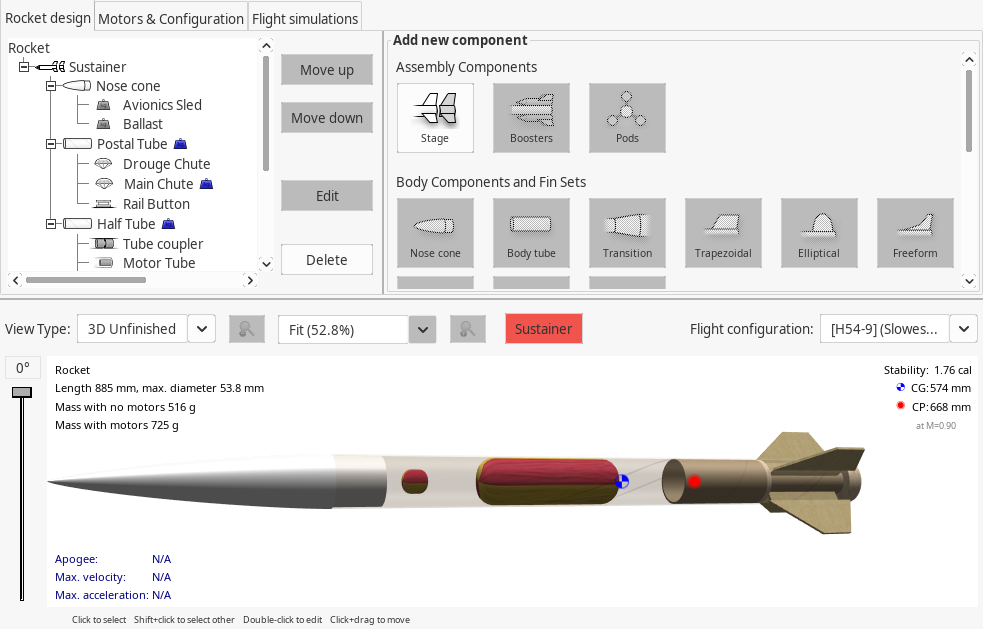
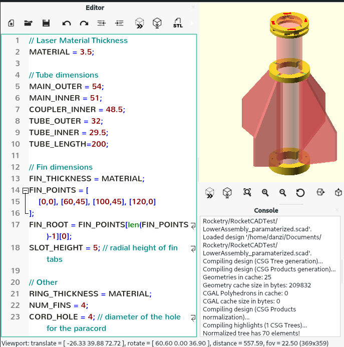
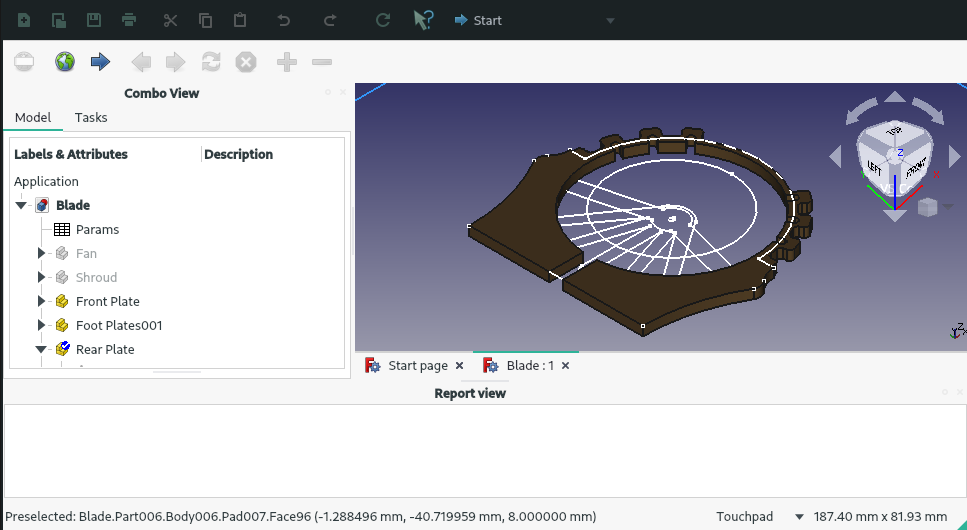
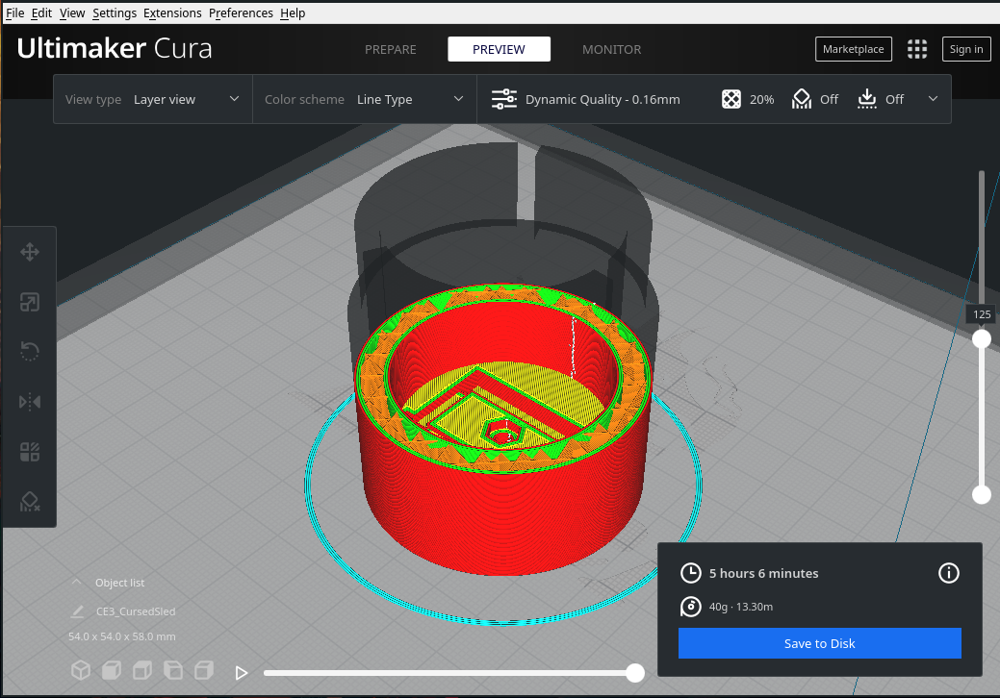
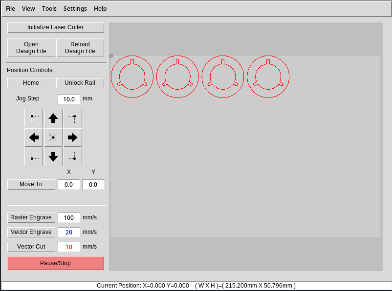

+++
date = '2022-04-19T00:00:00+00:00'
draft = true
title = 'Open and Accessible Design for Model Rocketry'
image = 'BannerImage.png'
tags = [
    "CAD"
]
+++
In today's blog post we're going to take a deep dive into the design processes we use at YAR. We set up these processes with the goal of having as many members as possible be able to work on designing our projects so they can be involved in every stage of the process. This also extends to anyone outside of the society that may happen across our website or github and is interested in making their own rockets based on ours. But first, how do we store and manage our designs?

## Git SCM and Github

In addition to openness and accessibility, we also strive for maintainability, and as such manage all of our designs with the Git source control manager. Git is well suited to this task as our main design files are all actually represented in text based formats, such as XML (although this required some work on our part - more in the OpenRocket section). This means we can take advantage of git features like branches for divergent variations of a design, tags to denote when we've built a prototype from a specific iteration of a design, and of course the ability to merge changes to designs that people have been working on separately, be that from across the room or across the country.

## OpenRocket

OpenRocket is where the meat of the high level design of our rockets occurs. OpenRocket allows you to very quickly and easily build an accurate-enough representation of a rocket design to be able to calculate key statistics like the center of mass and center of pressure, which are critical to ensuring a design will be safe to fly. Once the rough design is mapped out, OpenRocket can then also run 6DOF flight simulations of the design, using thrust curves from its database to simulate using any off-the-shelf rocket motor. Assuming an otherwise sensible design with sufficient structural integrity, the key values from these simulations tell us how the rocket will perform, and these are also what the launch site RSO (Range Safety Officer) will ask for before they allow the launch to go ahead, as values such as velocity off the launch rod and stability are key metrics to guarantee safety of the launch.

In order to have OpenRocket conform to our standards for accessibility and maintainability, we had to make a couple of our own changes. Firstly, despite active development on the project, when we started using OpenRocket there hadn't been a release for over 5 years. to ensure we were using the most up to date software without having to manually compile the whole package ourselves every time, we had two solutions. For Arch Linux users (somewhat overrepresented in the society), one of our members created a publicly available package on the AUR (Arch User Repository) that automatically builds the latest version of OpenRocket from source on the user's system, and integrates with their package manager to keep OpenRocket up to date whenever the user runs a system upgrade.

For maintainability, we had to make a change to the way OpenRocket saves designs to the filesystem. By default, OpenRocket saves (.ork files) are actually an archive containing a single XML file. Since the archives are treated as binaries and don't play nice with git, we made a custom fork of OpenRocket that would create saves as just the XML file. This allows Git to interact with the saves properly, being able to merge partial changes to the file together, be that parallel changes by users, or passing updates between branches.

## OpenSCAD

While OpenRocket is an excellent simulation tool, when it comes time to manufacturing parts it's no longer particularly useful as much more than a reference. As such, for 2D and 3D cad of parts we have opted to use OpenSCAD, a lightweight, free and open source CAD tool in which you can design parts parametrically using code - instead of interacting with an object in the GUI. While this may seem like an odd concept to some, the maintainability of simple, human readable text files is staggeringly better than the complex filetypes from your usual CAD program. Additionally, lots of more complex CAD software has a very steep learning curve, whereas OpenSCAD uses a limited number of very simple operations which have been much quicker for many of our members to pick up. The parametric nature of OpenSCAD is also invaluable, as we can reuse the exact same designs for entirely different rockets - for example, we have a single nose-cone design that we simply change the length, diameter, and shoulder dimensions of and we can re-use it in a totally different rocket. 

## FreeCAD

When OpenSCAD prooves to be to limiting, another excellent FOSS parametric CAD program is FreeCAD. While this does carry more of the drawbacks of traditional CAD software, it is significantly more powerful than OpenSCAD for some applications, like modelling on curved surfaces for example. Again we can continue to parameterize freecad designs in the same way as in OpenSCAD so we can continue to use these parts together.

## CAM Software

Once we have our 2D and 3D designs, we then need a way to use these in 3D printing and laser cutting. Our 3D print slider of choice is Ultimaker Cura, which has support for thousands of different printers so that anyone can easily replicate our results and the several members of our society with 3D printers can all use the same software. The laser cutter software we've been using is somewhat less common but still free and open source. k40whisperer is a hardware specific program which the laser cutter at our local Hackspace uses, and which one of the members there maintains an Arch package for. Luckily, this somewhat obscure software accepts standard svg and dxf files much like any other laser control software.

## Wrapping up
So, that rounds off our software suite and workflow for our design process! As you can see we have quite the mix, but we hope that by sticking with tools like this, anyone with access to their local hackspace or university should be able to replicate and build on our designs with ease. Looking into the future, one of our focuses is creating better build guides for our rockets, not only for passers-by of our repos, but also for ourselves to keep a better record of what we've done.

Keep an eye out for our next post soon about the story of our avionics development!