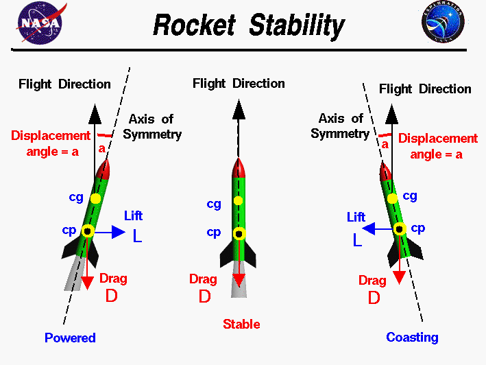
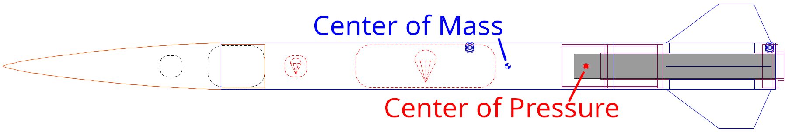
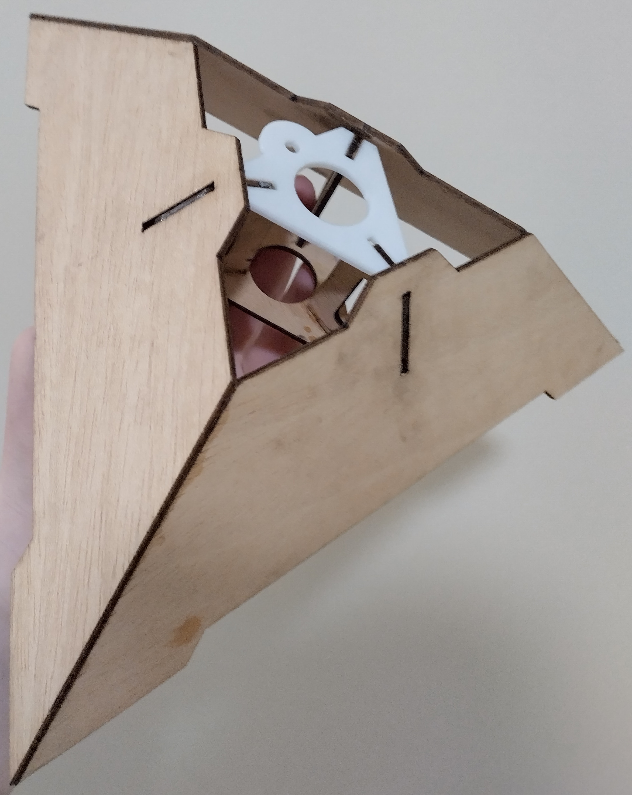
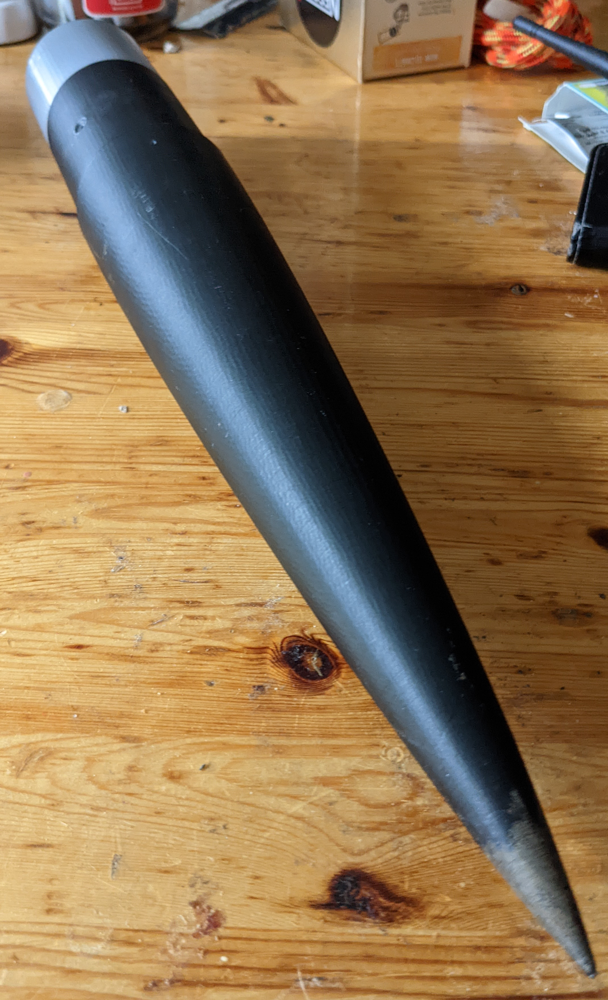
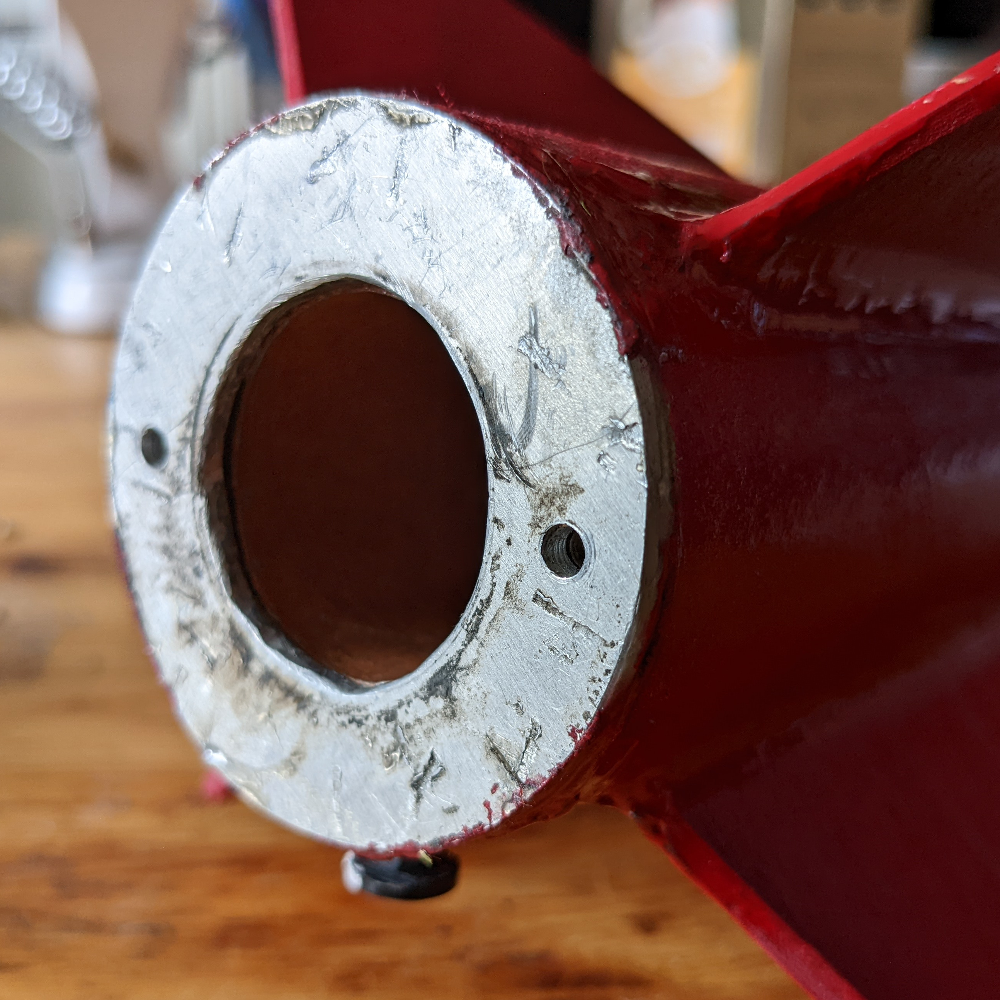
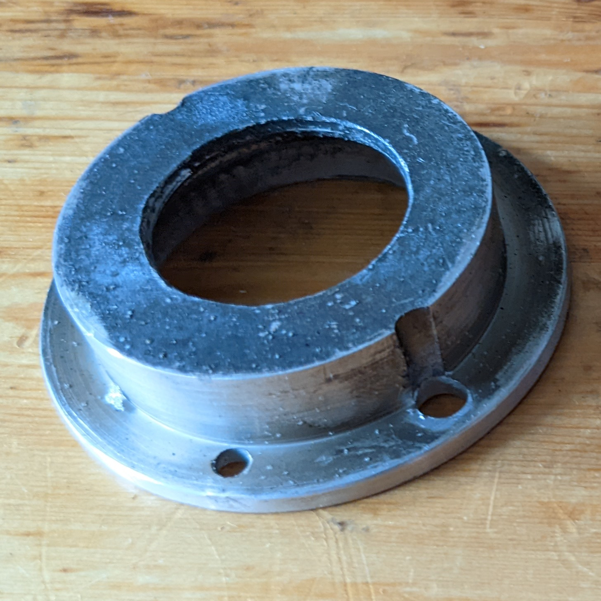
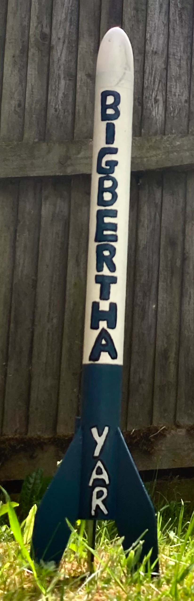

+++
date = '2022-04-19T00:00:00+00:00'
draft = true
title = 'How to build a Model Rocket: Nordri'
image = 'LowerAssembly.jpg'
tags = [
    "manufacturing",
    "competition",
    "Mach",
    "Mach-22"
]
+++

Today's blog post is all about how we built Nordri: our Mach-22 competition rocket, and the culmination of what we've learned over the last few months. We'll also touch on how you can get started in rocketry yourself!

## Basic Design
When designing your own rocket, there are two fundamental properties that you need to be sure to get right - the Centre of Mass, and the Centre of Pressure. You're likely already familiar with the concept of Centre of Mass; in our case, it's the point through which we model forces on the rocket - for example if we exert a force on the fins of the rocket while in flight, we would see it rotate around its Centre of Mass. The other key property is the Centre of Pressure. This is a measure of where aerodynamic forces act upon the rocket and is determined entirely by the shape of the rocket and its fins. 

In order to make a stable (and safe) rocket, it's important to keep the Centre of Pressure _behind_ the Centre of Mass. This means the rocket can correct itself in flight if it swings out of alignment, forcing it to point in the direction of travel. 

Here's our design for Nordri in OpenRocket, with the Centre of Mass and Centre of Pressure labeled: 

You'll see that the Centre of Mass is more towards the front of the rocket, and the Centre of Pressure is further back. In model rocketry, the distance between these two points is commonly referred to as the stability of the design and is measured in _calibres_. A Caliber is a relative unit, equal to the diameter of the main rocket body. The common wisdom is to stick somewhere from 1.5-2.5 calibres for a simple design, but of course, there are all sorts of weird and wacky rockets that don't stick to these principles, like this design called the "Foo Fighter".

Once you've satisfied these basic requirements, provided you stick to a fairly standard rocket shape, you're free to do what you want! In Nordri's case, we use quite powerful motors that require a certification to buy and fly, so we've gone to quite some lengths to ensure that she'll stay together under the intense forces of a launch with strong materials and meticulous reinforcement.

## Nordri's Structure
While these rockets happily endure upwards of 60G in some of our launches, you may be surprised to learn that Nordri's body is made out of a plain old cardboard tube! We like to use postal tubes as they are cheap and easy for us to acquire, and are plenty strong enough for the job.

Nordri's Nose cone is 3D printed from PLA plastic, with 2.5mm thick walls and a 50mm shoulder that slots securely into the body tube. This has to be a very clean fit, as not only does the nose cone need to stay in the tube during flight (not too difficult with the air resistance of the launch), but it also needs to be able to pop out when the ejection charge goes off, so that the parachute can deploy. In the early days, we added masking tape to or sanded down these shoulders to get them to the perfect size, but after enough trial and improvement, we've managed to start printing them perfectly to tolerance so they can immediately slot in and fly.

The really meaty part of the rocket is the lower assembly. This is the part that holds the motor, is where the fins attach, and is by far the most complex component. While some model rockets can get away with just gluing the fins to the outside of the tube, we went for integrally mounted fins. This means the fins go through the outer body tube and attach to both the inner motor tube and outer tube with epoxy fillets. Our custom laser cut centring rings slip over the end of the fins, which isn't a structural design feature, but really helps us line up all the components perfectly before they're epoxied together

At the base of the assembly, we have an aluminium thrust ring that we machined on a lathe. The motor casing (off-the-shelf enclosure for the motors we use) sits on this thrust ring and transfers all the force from the motor's combustion into the ring. The ring is epoxied to the bottom of the lower assembly and the outer tube, so it can evenly transfer this force into the main body of the rocket. 

Just beneath the thrust ring, inside the lower assembly between the laser cut centring rings, there are 2 nuts mounted. These allow us to bolt on the last component - the motor retainer (also machined on a lathe). This is a removable part that keeps the motor and casing inside the rocket while it's not firing.

## Challenges we faced building Nordri
After building 6 different iterations of Nordri, we know a thing or two about putting it together! Some of our biggest issues were:

### Inaccuracies in our measurements and manufactured parts
On several occasions, we've made parts such as our nose cone shoulders that weren't _quite_ the right size the first couple of times around, requiring either lots of sanding or additive tweaks like masking tape. We overcame these issues by trial and improvement and by performing fit-checks more often throughout the manufacturing process. This was, for example, especially helpful for laser-cut parts where we don't know exactly how much material the laser removes, so it's difficult to get sub-millimetre accuracy without directly checking the parts physically fit together.

### Main tube fin slots
While the integrally mounted fins are much more secure than the alternative, they do mean we have to cut slots through the outer tube of the lower assembly. This can lead to some splaying if these slots aren't cut perfectly or simply because the cardboard isn't entirely rigid. This is mitigated by the epoxy that holds this lower section together, but holding the splaying parts together while the epoxy set was a challenge. For this purpose, we designed and 3D printed a small tray (a "jig") for the drying rocket to sit in, with claws that reach up and apply pressure to the splaying tube sections, ensuring a snug fit until the epoxy sets and holds them in place

### Annoying fin design
Our original fin shape was close to a parallelogram, sweeping back beyond the end of the rocket to a sharp point. This caused several problems, most notably the sharp tip being a weak point that the rocket could land directly on and break. They also inhibited access to the rear of the rocket where we needed to bolt in the motor retainer. In response to these issues, our new fins have a more trapezoidal design, which has the added bonus of being more stable at trans-sonic velocities (speeds close to the speed of sound).

## How you can get started in model rocketry
We used some complex manufacturing techniques and tools in Nordri, including a lathe, laser cutter, 3D printer and epoxy, but this was all for mid to high power rocketry. Getting started in model rocketry can be much simpler! For example, one of the first rockets we built was an Estes kit called "Big Bertha". 

This is a very simple kit that comes with pre-cut fins, the main cardboard tube, a plastic nose cone, and an easy to assemble motor mount. These kits can be put together with little more than glue and scissors, and are a great way to get started in model rocketry! Once you've built a few kits, you can try moving on to designing your own with OpenRocket, but we'd definitely recommend joining your local (or in our case not-so-local) rocketry club to get advice from the certified members and RSOs (Range Saftey Officers) there before you launch your own designs. We learned a huge amount from the critiques that more experienced rocketeers had for our early designs.

---

That's all for today's post, stay tuned for a future articles, including our avionics escapades, and some flight data analysis!