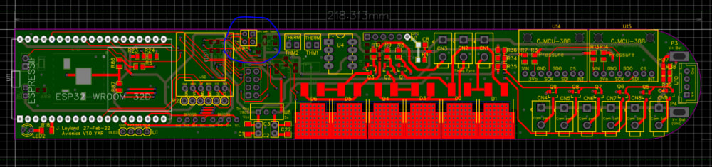
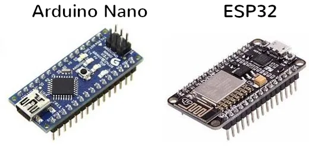

+++
date = '2022-07-25T00:00:00+00:00'
draft = true
title = 'Developing In-House Avionics for Model Rocketry'
image = 'pcbCad.png'
tags = [
    "electronics"
]
+++
Over the course of the last year, our progress in model rocketry has begun to call for us to start building our own electronics and avionics packages. Not only can homemade solutions be much cheaper than commercial alternatives, but it also provides another valuable opportunity for learning and developing skills within our society. This blog post will cover some of the things we've learned and components we've become familiar with during our first year working on avionics.

## Development Platforms

The core of any avionics system is the microcontroller. This is the component that coordinates all the other parts of the system - taking readings from sensors, logging them to the storage and sending messages to and from the radio. Throughout the last year, we've tried several microcontrollers all with their own pros and cons.
### Arduino Nano & Arduino Micro

The Arduino line of microcontrollers is intended to be an easy-to-use platform, which enables you to develop closer to the speed of thought - minimizing boilerplate in favour of simple, well-encapsulated libraries that can be used by new and experienced developers alike. The Arduino framework was a big draw for us but the Arduino platform itself came with some drawbacks. The main disadvantage was that all Arduino boards run on 5 volts, whereas all of the other components we wanted to work with used 3.3 volts for power and communication. While these standards can be compatible, sometimes with resistors or level-shifters, we decided it would be beneficial to move to a platform with a 3.3-volt logic level. Furthermore, when we started to look into other similar platforms, the Arduino nano's clock speed of 16MHz was comparatively very slow. This was the final push we needed to move on to…

### ESP 32 & ESP 8266

The ESP 32 is a dual-core microcontroller which is commonly used for wifi and Bluetooth applications, as these capabilities are built into the chip. We were attracted to the chip because, after the Arduino, it's one of the most common development platforms for small projects, and it also supports the Arduino framework. The clock speed increase to 80MHz on the ESPs (or faster on some variants) was very noticeable too, getting us much better data logging rates. The ESP 8266 is a single core chip which still met all the requirements we had for sensing and logging, and was also cheaper and had lower power consumption. For a time we used ESP 32s for more complex systems (for example sensing and logging with radio and GPS too) and the ESP 8266 for small-scale sensing and logging.
### Future prospects

While we've had some good success with the ESP line of microcontrollers, we're still on the lookout for alternatives. We currently have our eyes on the RP2040, which would allow us to compile for ARM rather than the Arduino framework, or natively for the ESPs. This opens up compiling from other sources such as Rust, and is also slightly more power efficient, but right now there are several drawbacks compared to the ESPs. The performance of the RP2040 is significantly worse than the ESP line, even considering per watt, and it's also missing a hardware floating point unit. Beyond this we'd be looking at more complex ARM chips with hardware floating point, to do in-flight filtering and calculations for active control.
## Radio Communication

Another point where we've trialled a few different solutions is for the air-to-ground radio system that provides telemetry during the flight.
### NRF24L01+

Inspired by the high-frequency systems used by drones, we first decided to try the 2.4GHz NRF24L01+. This radio was really well documented online and seemed to have many users, so we took it for a test drive with an accompanying Yagi antenna for the ground station. However, even with this directional antenna extending our range, we still struggled to communicate with the avionics system past 500m or so across the valley in which we tested. This is where we started considering other options.
### RFM95W

This RFM95W is a LoRa module - a class of radio that works over a long range and at a low power, but also a low bitrate. This was no problem for us as all we wished to transmit was basic telemetry data such as altitude and GPS coordinates, so LoRa was perfect for us. In testing the RFM95W we found we could easily communicate over ranges of 2km or more with a simple quarter-wavelength wire antenna on both the avionics package and the ground station. This made the RFM95W a perfect candidate for us, with the only drawback being the strange pin separation on the package.
## Accelerometer & Gyroscope (IMU)

One of the key measurements we need to take from the flight is acceleration and gyro data. This may not be incredibly useful in static data logging, but once we progress to active deployment of our recovery or second stages, interpreting the IMU data will be crucial to determining if it's safe to light the next stage, or if we've hit apogee and started descend.
### MPU6050

This was a standard cheap part we could get on nice breakout boards to test with easily, and we found it met the requirements for most of our flights. However, after one particularly powerful launch, we noticed we had actually topped out the 64g limit on the chip - quite the feat even within model rocketry. As such, we had to look for an alternative.
### ADXL375

This was a chip we happened to be able to source from RS Components, which could continue to measure all the way up to 200g. While this solved one of our issues, the ADXL375 doesn't have a gyroscope - only the accelerometer. As such we've resolved to put both the ADXL375 and the MPU6050 on our avionics packages. This not only grants us back the gyroscope but also allows us to more accurately estimate the state of the rocket using differential acceleration readings between the two accelerometers.
## Other Components
### Storage - SD Cards & Flash memory

Storing our logs proved to be somewhat of a challenge under the high g-force conditions of a rocket launch. The SD cards we originally opted for had a tendency to come dislodged during flight, no matter how well we secured them. One of the advantages of the ESP line of chips is that they have their own flash controller, so can access up to 16MB of non-volatile flash memory, which often comes equipped to the development board alongside the ESP chip itself. This solid-state storage allowed us to forgo the mechanical SD card to keep our important data safe.
### Altimeter

Of course one of the most important sensors in model rocketry is the altimeter - knowing how high you’re flying is crucial for recovery, validating designs, competitions, and of course for the satisfaction of knowing how high you launched! From the start of our development process, we’ve found that the readily available BMP280 and the more up-to-date versions such as the BPM390 have been perfect for our uses, and we’ve heard much the same across the hobby rocketry sphere.
## What we’ve learned

Through our trials and tribulations of trying to get our avionics suite working, we learned a few valuable lessons.
### Test, Test, Test

Thorough testing of all your systems is crucial, and even when you think you’ve tested a component, there’s likely to be something you missed. For example, we knew our radios had sufficient range from our testing, but one thing we failed to realise was that during the launch once the rocket was overhead, our antennae would be really poorly lined up at that key point in the flight, so we lost the vast majority of that telemetry.
### No last-minute changes! Hands off!

Last-minute changes at the launch site are often a recipe for disaster. Even one small change might cause the downfall of your whole system if it’s not been properly tested. Using a different battery? Test its life span before you fly it! Packing your chute release differently? Not on the competition launch pad! Test it first!
### Things won’t be perfect the first time round

No one’s perfect, and neither are PCB designs. Mistakes are of course inevitable, but even if you do get exactly what you wanted your requirements may have changed in the weeks or months you spent waiting for a PCB to ship. An iterative design process is incredibly helpful in electronics and avionics design.

 
Conclusions

We’ve surveyed lots of components and found some good fits for us, and we hope they can be useful for you too! We’ve also learned a lot from our plentiful supply of failures to fuel our future endeavours. We hope you enjoyed it, thanks for reading!
