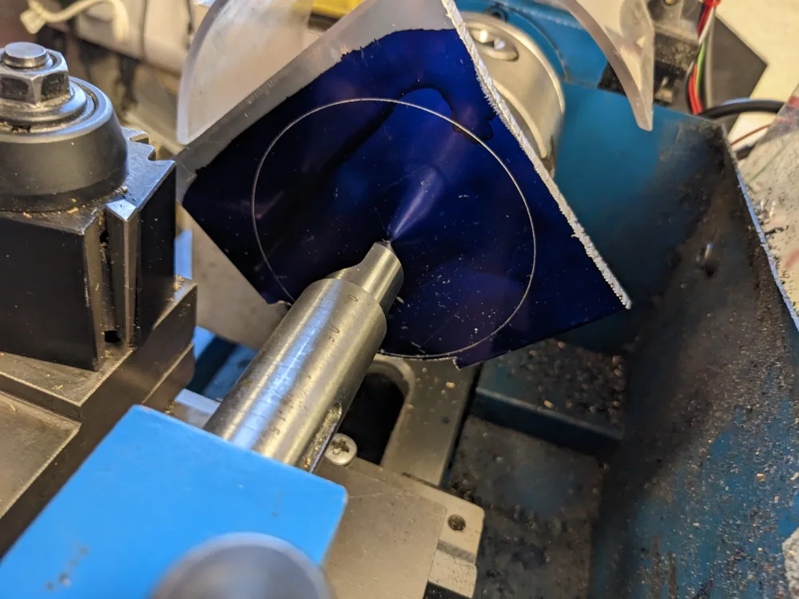
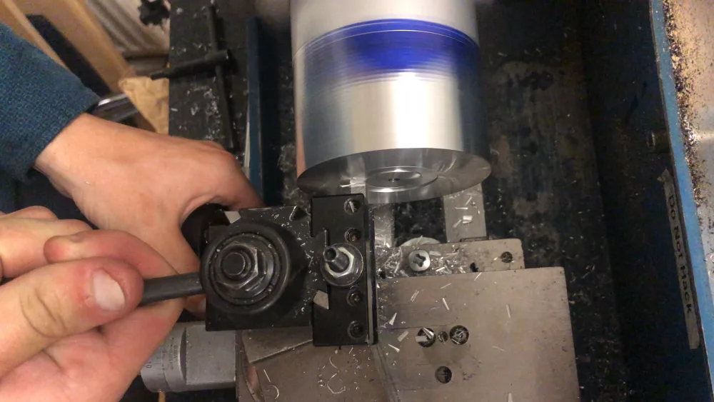
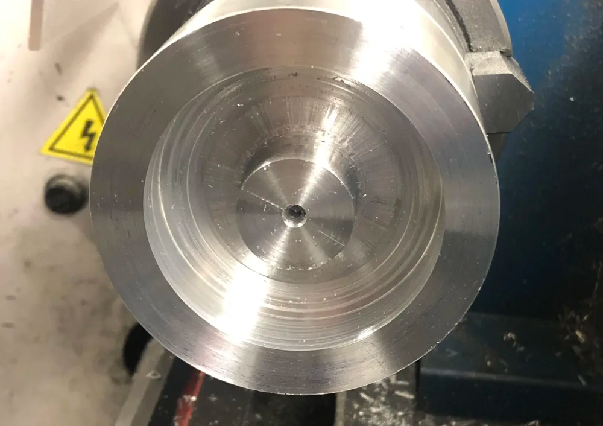
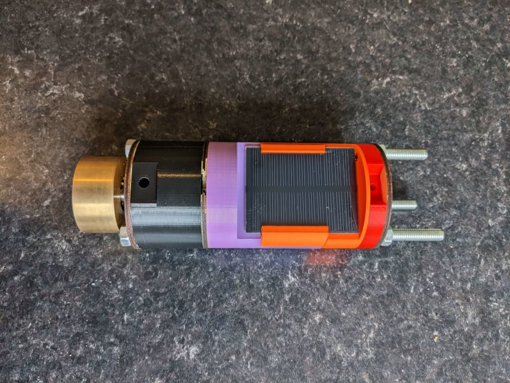

+++
date = '2023-07-20T00:00:00+00:00'
draft = false
title = 'Material Choices for Model Rocketry'
image = 'retainer.png'
tags = [
    "Manufacturing",
    "Competition",
    "Mach",
    "Mach-23"
]
+++
In many cases, 3D-printed plastic and laser-cut plywood parts are entirely suitable for model rockets. They are, however, neither particularly heat resistant nor strong enough to take the force of parachute deployment in larger rockets, like our competition rocket Freyja. For this reason, and others, we have had to machine some of our more critical components from metals and industrial plastics.

The reaction wheel for the CanSat payload also needed to be as dense as possible, so that it would have a large enough inertia to stabilise and rotate the cansat. Neither 3D-printed nor laser-cut materials are realistically dense enough for a reaction wheel.
## Freyja's Machined Parts

For our main competition rocket this year, we have machined three main components, a reaction wheel, multiple bulkheads and the motor retainer. The university has also provided us with several custom-punched steel parts.
### Bulkheads

The rocket bulkheads are components that separate different sections of the rocket from each other and act as attachment points, usually to a parachute or streamers. In our case, we needed three bulkheads. Two of these were simple circles of sheet aluminium, that are epoxied in place. The other has to be removable, as it attaches the nosecone to the parachute and avionics bay, but will block access to the ballast in the nose.

We machined the plain bulkheads as 76mm rounds, but first creating a rough shape using a hacksaw, then supergluing them one at a time to a piece of faced, round steel. This is traditionally referred to as a ‘wax chuck’, as shellac was used to stick the workpiece to the piece of material. It is now relatively common practice to use super glue for this job. However, it should not be used for long, heavy parts, or with high machining loads, as it is very easy for a part to come off the chuck. For machining sheet aluminium, this is not a problem.

The nosecone bulkhead was made in two parts: an outer ring which is epoxied into the nosecone, and a removable piece that can be attached to the outer ring.

The inner bulkhead was first created as a blank, which would then have a thread cut onto the outside of it using the lathe lead screw. The outer ring would then have an internal thread cut into it, with a lip to allow the bulkhead to be tightened on.

Due to recent upgrades to the lathe we were using with an electronic leadscrew design, this proved to be difficult, leading to this idea being abandoned. 

Instead, the blank was machined as planned, but without a thread on the outside. The lip on the outer ring was machined to be far wider than originally planned, and six holes were tapped in a circle (with six matching clearance holes in the inner blank). 

The outer ring itself was machined out of a solid piece of aluminium, with the hole being made by stepping up drill sizes until we had no larger drills, then boring it to its final diameter (and using a boring bar to machine a step). 

Six steel, M4 cap-head screws were then used to hold the pieces together.

As a note, steel-on-aluminium is susceptible to galvanic corrosion, where the aluminium will begin to corrode more quickly than the steel bolts. However, given the parts will be kept dry when in storage and used for three or four short flights, this is not a problem. It would usually take years and is generally only a problem in damp or corrosive environments.
### Motor Retainer

The motor retainer is another critical component of a rocket, as it stops the motor falling out of the body tube when the motor is not firing (before launch, and after it has burnt out).

Freyja is what's known as a minimum diameter rocket, which means that there is no room at the bottom of the rocket to screw on a standard retainer ‘cap’. For this reason, the motor casing has a UNC-⅜-16 screw thread at the top, which we needed to attach to the outer tube. 

Our solution was to machine a piece of aluminium with a threaded through-hole. This then had a large amount of material removed from around the hole, to remove as much mass as possible. This was an interesting exercise, as we made the trepanning tool a little too wide, which combined with the lightweight nature of the lathe and the dying drive motor, meant machining the initial groove took several hours longer than necessary. Soon after this, I finished building a tool and cutter grinder which would have solved this problem relatively easily.

We then bored out the ring to bring the recess to its final dimensions. We also decided not to put rounded corners onto the inside edges, as it had already taken far longer than was originally planned, and the thickness of the material was already several times thicker than was necessary to take the forces involved.

### Reaction Wheel

Reaction wheels are not usually found in model rockets, as active stabilisation and orientation are quite difficult to achieve. However, for the Mach competition, we are launching a CanSat on our rocket, which will be deployed when the motor burns out. This is designed to demonstrate orienting a solar panel at the sun, which will require a reaction wheel.

The reaction wheel needed a high moment of inertia in order to control the rotation of the CanSat. Given that the length of the payload is constrained by the competition, and the diameter is constrained by the diameter of the body tube of the rocket, the only option for increasing the moment of inertia is to increase the density of the material. Brass has one of the highest densities of the ‘easily obtainable’ materials and is also very easy to machine using ground HSS tooling. Carbide insert tooling tends to ‘grab’, though will machine it if you are careful.

The reaction wheel was machined by first drilling an accurate through-hole, then a recess for a bearing and the stepper motor coupler. The part had to be turned around, requiring the part to be accurately positioned in a four-jaw chuck with a dial indicator. With hindsight, it would have been better to directly attach the stepper motor to the reaction wheel, though finding a long enough tap would be difficult.

The bearing supports the reaction wheel from below, using a 3D printed ‘pin’ to attach the centre of the bearing to the bottom bulkhead of the cansat. The use of a 3D-printed pin was mostly so that the bearing can move the pin slightly to sit the wheel centrally.

## Conclusion

In conclusion, the ability to use machined parts in model rocketry is extremely useful, particularly in larger designs. Being able to do the machining ourselves has been indispensable, as we have been able to modify our parts when they have gone wrong, or designs have had to be changed at the last minute. For instance, during the initial test launch, we encountered difficulties in fitting the bulkheads to the avionics bay as they didn't align with the tube properly. Our ability to ‘just do it ourselves’ was very helpful in this case, we were able to machine a slight recess onto the inside faces of the existing parts, avoiding the need for a complete remake.
