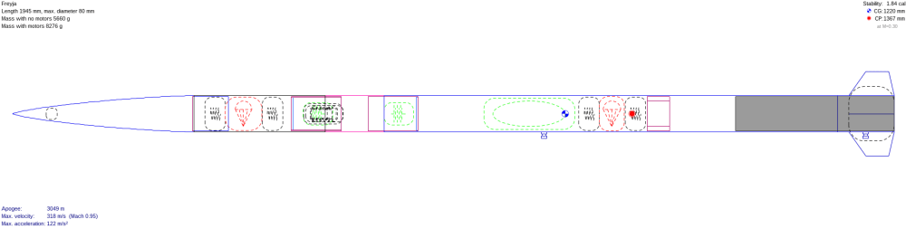
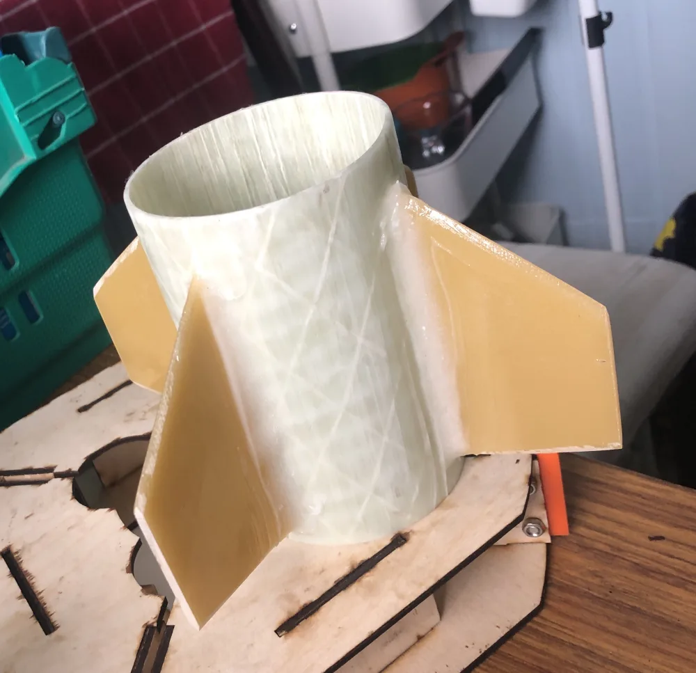
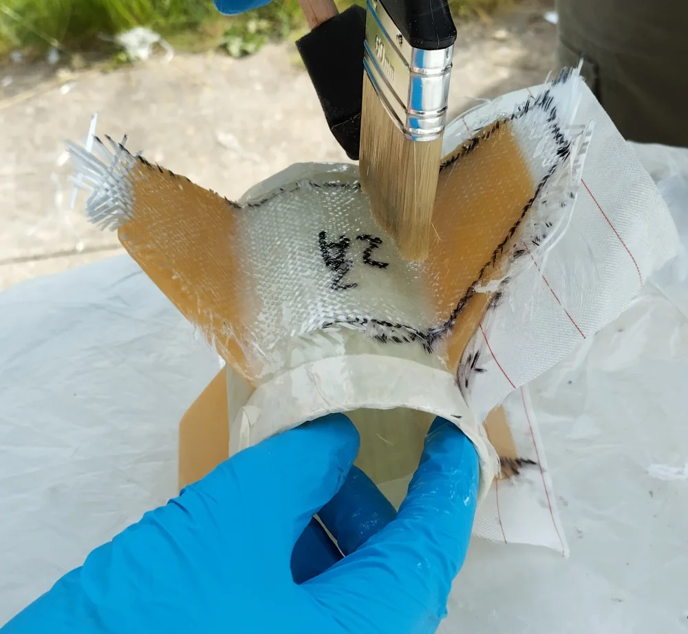
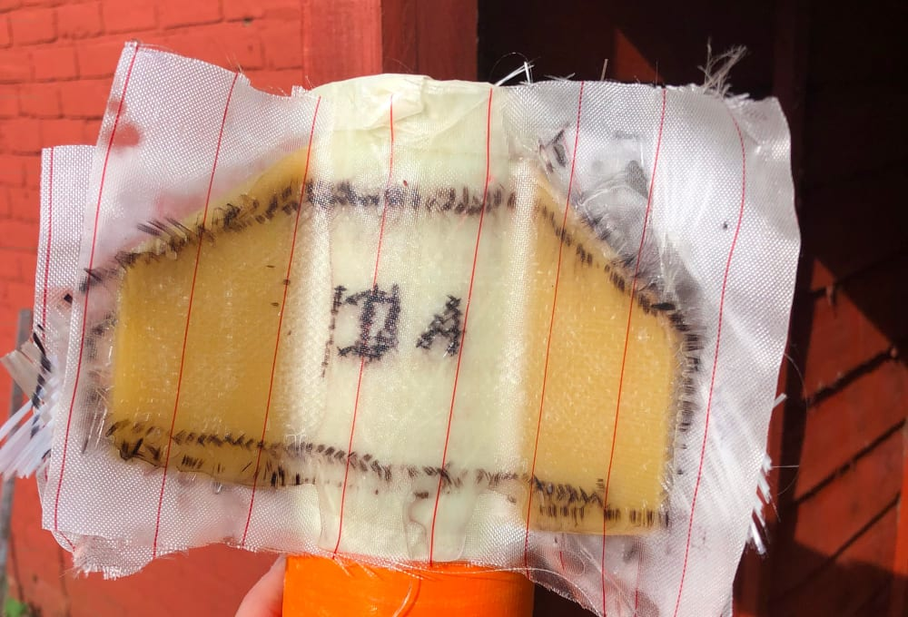
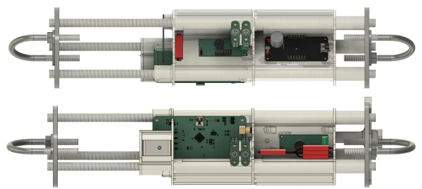

+++
date = '2023-08-04T00:00:00+00:00'
draft = true
title = '     Mach-23 Pt 1: Design and Build'
image = 'banner.png'
tags = [
    "Manufacturing",
    "Competition",
    "Mach",
    "Mach-23",
    "CAD"
]
+++
Last year, we showed you how we designed and built our Mach-22 competition rocket; [Nordrii]( ). Nordrii was an incredibly cheap design we could rapidly iterate; it provided many learning opportunities and worked well with our limited budget. This year, however, we had much more funding from our partners at RS and YuFund. So, when Mach-23 was announced we decided to aim higher. Literally.
## Mach-23

Last year we competed in a simple altitude category; whoever got closest to 1km got the most points. This year, however, we opted to compete in the “3km with cansat” category.  The requirements for this were, in summary:

- Reach an altitude of 3km.
 
    The team that gets closest to 3km gets the most points, simple enough.
- Deploy a 1kg cansat at apogee.

    A cansat is a simple payload -approximately the size of a drinks can- that is ejected from the rocket and performs some experiment on the way down. The awkward bit here is the weight requirement. For reference, Nordrii weighed about 1 kg with motor installed. Carrying a 1kg weight up to 3km requires a much larger motor; hence a much larger rocket.
- The rocket must land within 1.5 km of the launch site and at a speed below 15 m/s.

    Mach-23 was held at the former RAF Machrihanish airbase. Ideally, we need to land within that airbase, or the land owned by the MACC company. Failure to do so risks landing in the ocean, or landing in a farmer’s field. We also have to land at a slow enough speed to avoid injuring anyone who may be nearby.

With these requirements in mind and the lessons learned from last year, we started to design our entry.
## Introducing Freyja

One of our vendors once told us “model rocketry is the fastest way to turn money into smoke”. This is mostly thanks to the rocket motors. There are no UK manufacturers, and only two people importing them from the US. With that in mind, we designed what is known as a “minimum diameter rocket” i.e. a rocket where the motor completely fills the inner diameter of the body tube.

This isn't actually how model rockets are usually built. If you look at Nordrii you’ll see that the motor is substantially thinner than the body tube. This produces a lot of extra drag, but it is easier to build and gives more room for a payload. It also lets you mount fins through the walls of the tube, which is much stronger.

We based our design around an off-the-shelf fibreglass tube that would conveniently fit a 75mm rocket motor. 75mm was also wide enough for us to comfortably fit our cansat, parachutes, and avionics. We have experimented with [making our own tubes]() in the past, however, that’s quite a messy process and the result is quite rough.

A 1.5km landing site is quite small for a 3km rocket; if we deployed a single parachute at apogee we would almost certainly drift outside that radius and into the ocean. However, if we just let the rocket fall ballistically it would quickly be travelling too fast to deploy parachutes. Instead, we used two parachutes. One, deployed at apogee, to slow us to around 25 m/s, and a second deployed before landing to slow us to around 5 m/s. We opted to use a pair of Eggtimer Quarks to control this deployment sequence. Ideally, we would have used two different flight computers for dissimilar redundancy, but this is what we had on hand.
## Building Freyja
### Motor Retainer & Bulkheads

Initially, we had hoped to get these CNC’ed by the university, however the waiting list for the CNC is long, and unfortunately one of the technicians fell ill. Fortunately, one of our members owns a mini-lathe, and was able to produce all of our turned parts. We have a [full blog post]() on this process, for anyone who is interested.
### Fin Can

Since Freyja is a minimum-diameter rocket, we weren't able to mount the fins through the wall, as we had on Nordrii. We also couldn't just tack them onto the side of the tube, as fin-flutter would likely snap the fragile joints. Instead, we opted to do what is known as a “tip-to-tip layup”, where fibreglass is laid from the tip of one fin to the tip of the next.

We started by cutting some fins from a sheet of fibreglass stock, then supergluing them onto the tube with the help of a simple jig. We could then reinforce those superglue joints with epoxy fillets. Once all that had dried we could begin the actual layup.

We measured out the size and shape of the area we needed to cover in CAD, then cut pieces of raw fibreglass to match that. Then we roughed up the tube and fins with some sandpaper, giving the epoxy a nicer surface to bond to. Finally, we laid the fibreglass onto the fin can by dabbing it with epoxy.

Historically, we’ve always gotten a poor finish from these kinds of layups, so this time we experimented with adding a layer of peel ply on top. This absorbs all of the excess epoxy and can be easily removed once it has been cured. This worked incredibly well, leaving a nice smooth finish, and is certainly something we will use again.

Unfortunately, we had to repeat this process in order to join the fin can onto the actual body tube. Previously we had hoped that we could hold it in place with the motor but after further consideration by RSO’s, it was decided the lateral forces would likely be unsafe as the motor casing wasn’t designed for such forces
### Nosecone

The nosecone on Freya was unusually complicated, consisting of 3 parts epoxied together. The main section was a 3d-printed Von-Karmann cone, that we paid to have 3d-printed from nylon. For the money we paid, this was pretty underwhelming, The nylon was even more brittle than the PLA we’ve been using, causing it to snap on every landing.

There was also a bulkhead and a length of fibreglass coupling tube, which were epoxied into the cone. We also ended up having to epoxy on a new tip, when the original snapped off.
### Avionics Bay

At Mach-22 we mounted our avionics by packing them into the nosecone with some kitchen sponge. It goes without saying that this is not ideal. This year we opted for a dedicated avionics bay, where all our electronics were mounted to a 3d-printed frame, called an avionics sled. This worked far better, however, cable management proved very difficult in the narrow rocket body.

(See the JST power splitter cable in the lower figure for an idea of scale and hence our wiring difficulties!)
Final remarks

We hope you’ve enjoyed this look into our design and manufacturing process. We hope to be publishing an article on [Mach-23]( ) itself very soon. If you’re interested in starting in model rocketry, take a look at our previous articles on [Nordrii]( ) and [some FOSS CAD tools]( ) you can use.
