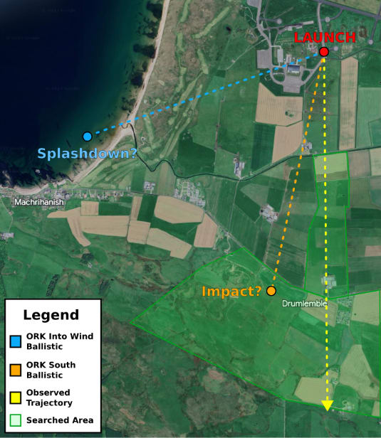
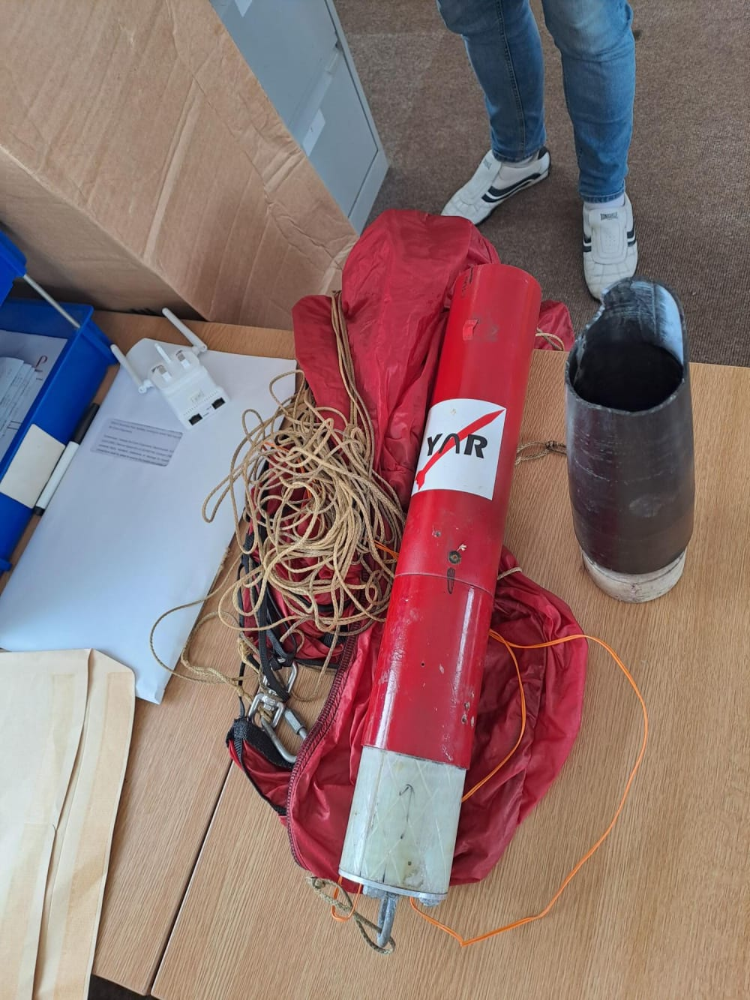

+++
date = '2023-08-10T00:00:00+00:00'
draft = false
title = 'Mach-23 Pt 2: The Flight'
image = 'banner.png'
tags = [
    "Competition",
]
+++

> “Everything that can go wrong will go wrong”

In our [last post]( ), we covered the design and build process of our Mach-23 entry: Freyja. This was the largest project we’ve attempted to date, featuring new deployment systems, homemade GPS trackers, and a deployable payload. All of these had to work on the day, in a rocket, under up to 11 Gs of acceleration! As you may have gathered by the tone; things didn't go as planned. In this post, we'll dissect the launch saga, extracting valuable lessons from our journey.
## Timeline
### June 28th, T - 1 day

While waiting at York station, the first piece of bad news made its way to us; our payload specialist had fallen ill. Sure, the software wasn’t fully finished and implemented, but it wasn’t safety-critical, so we bodged on!

But the fates weren’t happy just taking down our specialist, at about 23:00 that night, the payload controller died entirely. Not to worry, we had a spare GPS tracker and continued our bodging so we could at least get some data. It’d effectively be a brick, but it’d be a safe brick, and we’d be able to find it. This did mean that we’d have none to spare, but that should be fine.
### June 29th, T - 3 hours

And yet, the killer lived on, one of our GPS trackers mysteriously died during the integration process. Fortunately, we had a partially assembled one, so after borrowing some spare parts from the other teams (thanks StrathSEDS!), we were able to get two trackers working again.
### June 29th, Launch

And so came the final integration and setup on the pad! As we all excitedly counted down, a few murmurs of a lost GPS signal were drowned out by our excitement as the button was hit. Not to worry though, we all heard those happy avionics chirps, it should be fine.

A second goes by, nothing on the ground station, then two, then three. It was time to pray.

In the moment, no-one cared, the rocket turned into the wind, with RSO’s noting that the rocket corkscrewed on its way up. Then our final lot of bad luck, it went full Icarus on us, flying straight into the sun!.
### June 29th & 30th, Search

The reality soon set in, without any GPS tracking, we only had intuition, simulations, and a handful of claims to work with. This gave us a wide search area, most of which covered private farmland. To top it off, a storm was blowing in. A few other teams brought drones and did offer them to us, but the weather prohibited it. This left us trudging through the fields we had permission to search, in the pouring rain.

Two days of searching and no sign of Freyja. At this point, we assumed that the parachutes failed to deploy. Freyja fell ballistically, landed hard, and was buried in the mud. With heavy hearts for our lost sister, we started the trip home.

At least we didn't have much to carry.
### July 14th, Mysterious Reappearance

Two weeks after the launch, our project lead received this picture via whatsapp:

Freyja’s avionics bay, nosecone and upper body tube were found, along with the parachutes. Unfortunately, at the time of this writing, they’re still in Scotland. The lower assembly and cansat are both still MIA. The only good sign we have is that the people who found it reported it was “still beeping”. At least the rain hasn’t gotten to it.
## Lessons Learned

There isn’t much use speculating about what happened during the flight until Freyja is back with us. Hopefully, the flight data logger is still intact, in which case we can get solid data on what happened. There are, however, many more general lessons we can take from this:

1. Test like you fly, fly like you test.

    We performed a test flight at MRC a few weeks before the launch. This was invaluable, and let us work out some kinks in our parachute deployment system. However the MRC flight did not have the payload on board, so the payload ejection was not tested. It’s possible that this interfered with the drogue chute deployment. Likewise, the GPS trackers were never tested on battery with the avionics bay closed up. We could have been putting them into a faraday cage.
2. If there’s a problem, speak up.

    Several members knew about the GPS failure. For my own part, I did not wish to delay the launch. In hindsight, this was foolish. A delayed launch is nowhere near as bad as losing the rocket.
3. Redundancy.

    This applies to both avionics systems and members. Both the payload and GPS tracker were last-minute projects carried out by single members. When one member went missing, we were in serious trouble. Likewise, if we had a secondary tracking system, the failure of the GPS tracker would not be so damning. Wildlife radio trackers may work for this.
4. Scope.

    This was a big leap for us. We introduced several new systems that we had not previously worked with and overall, this was just a much larger rocket than we’d flown before. It's very possible that we bit off more than we could chew.
5. Scotland is rainy.

    Several members forgot to bring coats, waterproof clothing and appropriate footwear. This did not end well for them.

## Closing Remarks

We hope you’ve enjoyed this two-part series, and we hope that you’ve taken some lessons from it. We certainly have, and we aim to return to Mach next year. Hopefully, we’ll get to keep the rocket this time!

We’d like to thank RS Group for their support throughout this project, along with the University of York and YuFund. Without their generous support, we would not have been able to do any of this.
