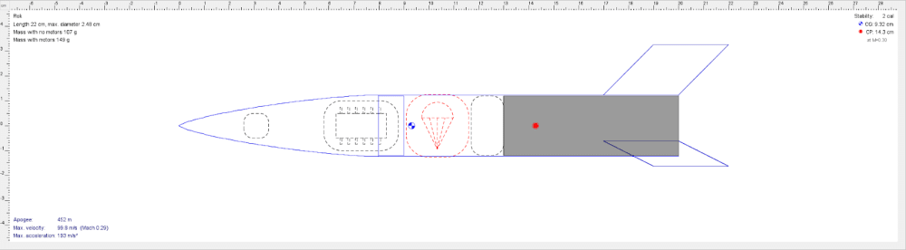
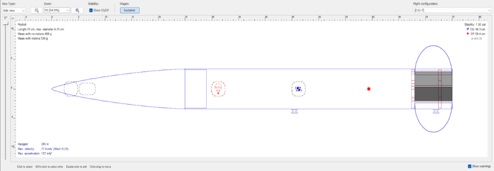
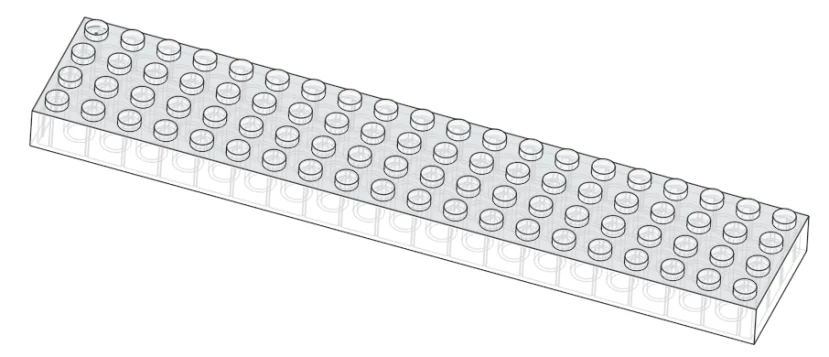

+++
date = '2023-11-29T00:00:00+00:00'
draft = false
title = 'Organising a rocketry society - Part 1 - introductory workshops'
image = 'banner.png'
tags = [
    "Team",
    "Mach",
    "Mach-23",
]
+++
In chairing a university rocketry society, I’ve found many people get stuck in the mindset of ‘well, isn’t it literally rocket science??? I’m not smart enough for that.’ As someone who aims to keep things accessible, I’m always disappointed to see starry eyed individuals walk away without even giving it a shot.

But even more-so, I’m disappointed that those who try, often have their views reinforced. Through no fault of their own, getting into rocketry is often very intimidating. While model rocket kits allow anyone to launch with a days work, moving beyond that to an L1 certification is still out of reach for many.

Now as I write this, UKRA has released their [project odyssey](https://hub.ukseds.org/p/project-odyssey) which provides strong guidance on what milestones to aim for, but the skills to get there are still rather undefined.

Given this and the majority new committee the society is faced with this year, I decided to build a workshop series to help people build all the skills necessary to reach an L1 certification within the year. This blogpost represents a halfway point, my lessons learned thus far, and my advice to any future society leaders.

The workshop is set to two hours per week, with approximately 1h 30m of content and 30m of general discussion time, with recommendations of what further exploration can be done outside of sessions.

**So far we’ve covered:**

- An introduction to OpenRocket
- Using OpenRocket to design and sim your first rocket
- Constructing a BoM (bill of materials) for your rocket
- An introduction to CAD

**With following sessions aiming to cover:**

- An introduction to PCB design for avionics
- Manufacturing techniques, tool training, and building your rocket
- Embedded programming for avionics
- Preparing a rocket for launch

## An introduction to OpenRocket

OpenRocket is such a versatile tool that for any advanced course in model rocketry, it’d be a crime not to teach it! The main outcomes of the session are to:

- Download and interface with OpenRocket
- Define what OpenRocket can and can’t sim
- Define centre of gravity, centre of pressure and stability parameter
- Explain how to balance a rocket and move the centre of pressure
- Practice with a half-complete rocket then maximise height for a given motor size.
- Finally, discuss if the winning rocket would work in the real world

The key takeaways from teaching this workshop are that people really benefit from being able to interact with an example rocket as I go through the slides. The real heavy lifter is the intuitive UI of OpenRocket, very few people struggled with navigating the components or adjusting key values as they went along.
## BoM, sourcing and designing your own rocket

This is often where people get stuck when not working on kits, finding parts that can be simulated may seem simple at first, but for those approaching the hobby for the first time, the choices are often paralysing.

To address this, I and other venerated members of the society curated motors, recovery, body tubes etc. in a single spreadsheet with prices and links. This allowed people to go part by part in their OpenRocket design and if unsure, have recommended defaults to fall back on. We still allowed people to explore the market and add to the components sheet, but we found most opted to remain within the initial constraints.

This was initially set to be a single session, but many really struggled with finding information to justify their choices despite our efforts to cover everything in the prior session and the links to blogs on individual parts.

Key struggles were:

- Parachute sizing
- Forgetting motor retention and engine blocks
- Despite our efforts, many were still overwhelmed and left without asking questions and before we could get to them!

In the end, the key to keeping people engaged was to have someone competent shadowing no more than three people at a time so people could ask questions without having to address the group as a whole.

These were two of the rockets designed during the workshop, both using Estes D12 motors:

## Introduction to CAD - Onshape

This was a particularly difficult session to condense down, both from me coming from an Autodesk background and having the limited 1h 30m timespan.

The goals of the session were to:

- Introduce the concept of CAD
- Explain good CAD principles (parametric design, keep aesthetics separate, organisation etc.)
- Introduce people to the UI of Onshape
- Briefly explain all tools available in the sketch and design workspaces
- Demonstrate the modelling of an NxM lego brick
- Allow time for people to model a mating item between a circuit board and avionics bay.
- Finalise with using a parametric curve to design their own nosecone to be 3D printed based on their open-rocket design.

This session would have greatly benefited from more time, many were overwhelmed with my decision to do a brief introduction to all the tools available. This can be improved by providing extra time and mini 5-min exercises to ‘find the right tool for the job’. In addition, much of the time was spent getting people set-up with an onshape account, this should be done in advance in future.

Although, I don’t think the session was a failure, CAD is a very experience driven skill so I hope that the introductions and activities provide people a solid ground to come back to/work with. I finished the session by encouraging everyone to try and build an assembly of their OpenRocket design to get to grips and the results of that remain to be seen!

NxM lego brick used as a walkthrough in the CAD work, hidden edges visible:

## Conclusion

So far, the workshop series has been a success, taking people from a variety of backgrounds to a position where they have designed, simulated and are prepared to build a rocket from scratch. Moreover the extra effort put into truly understanding the fundamentals will be vital to the continued growth of the society and in particular our competition rockets.

Thanks for taking the time to read this!
## Resources:

OpenRocket intro ppt: [Link](https://docs.google.com/presentation/d/1j6eqSBVwh0J68I1ofZaq2S1Ew-1fU8QS4HR12xrYdZY/edit?usp=sharing)

BoM template document: [Link](https://docs.google.com/spreadsheets/d/1iXGrAqQ8SxsZdKLSx6Ko6iKi_03ksr-cHRN1NHkBtTQ/edit?usp=sharing)

Introduction to CAD - Onshape ppt: [Link](https://docs.google.com/presentation/d/1Q-CBEohRDjFD6Hn3xmHnGzZGXfa4o3dj354HdmT7o1A/edit?usp=sharing)
